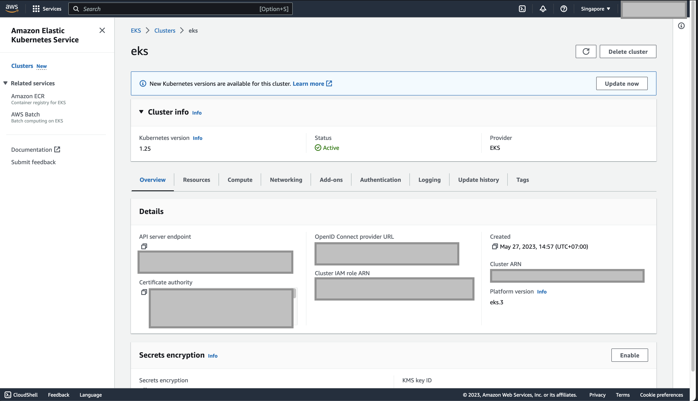
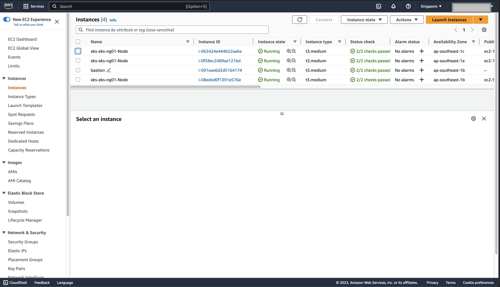
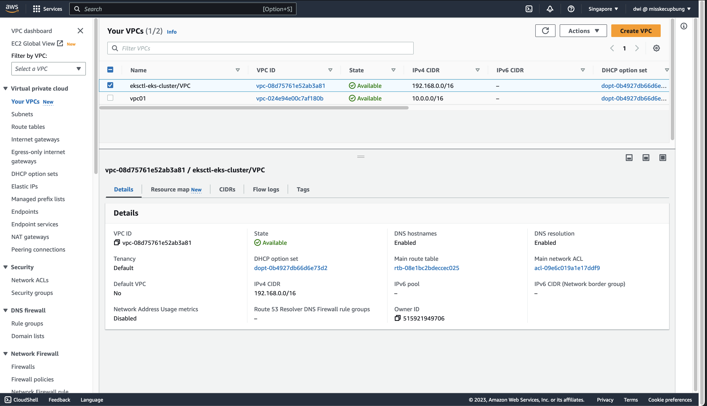
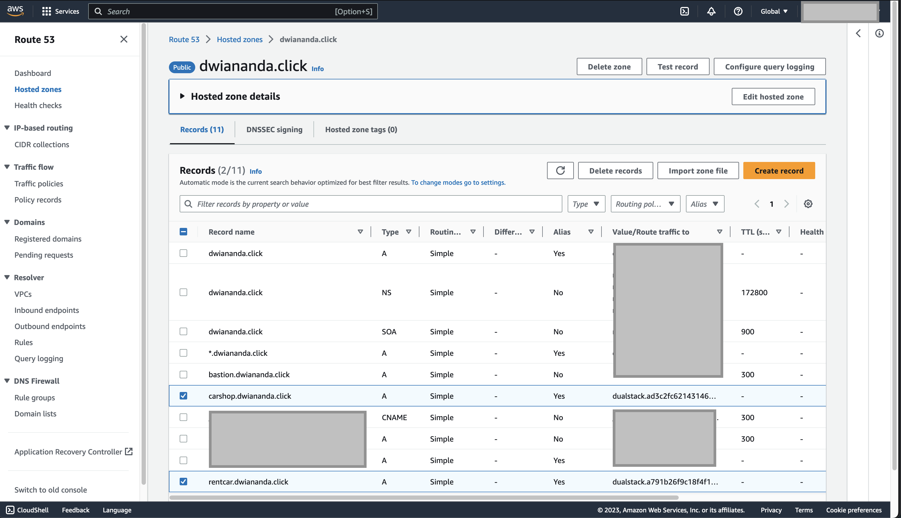
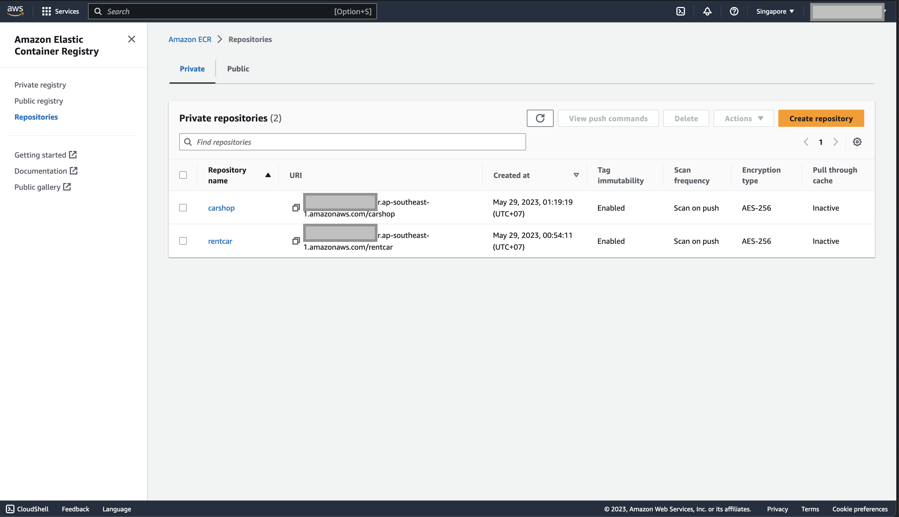
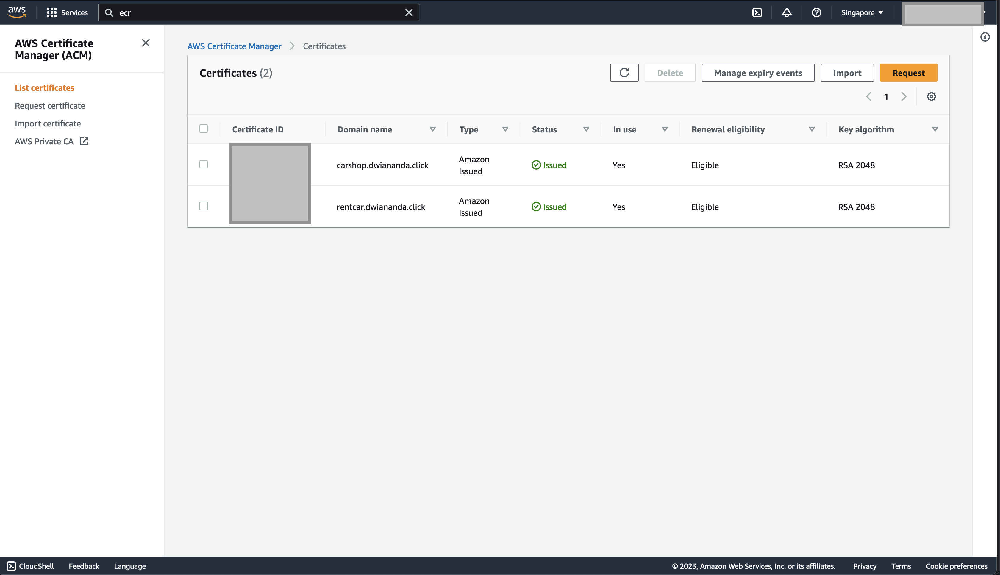
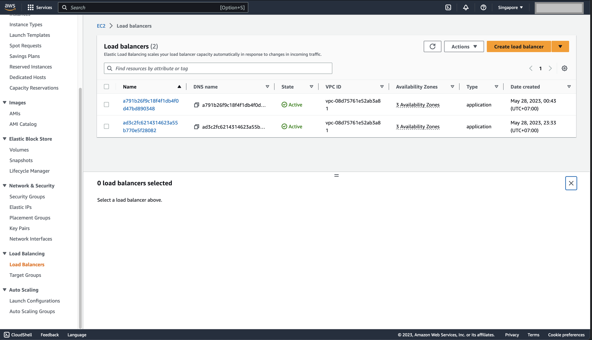
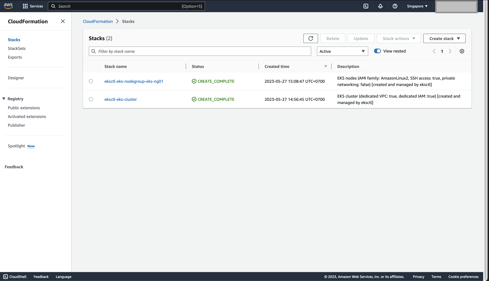

# CI/CD for Amazon EKS using Github Action

## Descriptions
This repo contains two backend applications named rentcar based on Go language and carshop based on Node.js that will automatically deployed to Amazon EKS cluster using CI/CD 
Github Action.

### rentcar
This is a simple rest api for rent car service based on Go programming language without relying on external frameworks. The folder contains code itself and manifests file on 
manifests folder for Kubernetes deployment and service. Source code: [https://github.com/worlpaker/go_rentacar_restapi](https://github.com/worlpaker/go_rentacar_restapi)

#### Features
- Manual handling of routing, middlewares, and helper functions.
- Swagger Documentation
- Go unit tests with mocking MongoDB

#### Components
- Go
- Javascript
- Docker
- MongoDB

#### API Endpoints
- https://rentcar.dwiananda.click/ (404 not found)
- Swagger: [https://rentcar.dwiananda.click/api/swagger/index.html](https://rentcar.dwiananda.click/api/swagger/index.html)
- cars
  - **GET** : [https://rentcar.dwiananda.click/api/cars/available](https://rentcar.dwiananda.click/api/cars/available)
  - **POST** : [https://rentcar.dwiananda.click/api/cars/reserve](https://rentcar.dwiananda.click/api/cars/reserve)
    <br> Example value: 
    ```json
    {
      "name": "string",
      "nation_id": "string",
      "phone_number": "string",
      "surname": "string"
    }
    ```
  - **GET** : [https://rentcar.dwiananda.click/api/cars/showreservedcars](https://rentcar.dwiananda.click/api/cars/showreservedcars)
- Locations
  - **GET** : [https://rentcar.dwiananda.click/api/locations/show](https://rentcar.dwiananda.click/api/locations/show)


### carshop
This is a simple rest api for car shop service based on Node.js and MongoDB as a database. The folder contains code itself and manifests file on manifests folder for Kubernetes 
deployment and service. Source code: [https://github.com/jonathankarlinski/car-shop](https://github.com/jonathankarlinski/car-shop)

#### Components
- Typescript
- MongoDB
- Mongoose
- NodeJS
- Docker
- Mocha
- Chai
- Sinon
- POO
- CRUD

#### API Endpoints
- https://carshop.dwiananda.click/ (404 not found)
- cars
  - **GET** : [https://carshop.dwiananda.click/api/cars](https://carshop.dwiananda.click/api/cars)
  - **POST** : [https://carshop.dwiananda.click/api/cars](https://carshop.dwiananda.click/api/cars)
    <br> Example value: 
    ```json
    {
      "model": "Marea",
      "year": 2002,
      "color": "Black",
      "status": true,
      "buyValue": 15.990,
      "doorsQty": 4,
      "seatsQty": 5
    }
    ```
- motorcycles
  - **GET** : [https://carshop.dwiananda.click/api/motorcycles](https://carshop.dwiananda.click/api/motorcycles)
  - **POST** : [https://carshop.dwiananda.click/api/motorcycles](https://carshop.dwiananda.click/api/motorcycles)
  <br> Example value:
  ```json
  {
    "id": "6348513f34c397abcad040b2",
    "model": "Honda Cb 600f Hornet",
    "year": 2005,
    "color": "Yellow",
    "status": true,
    "buyValue": 30.000,
    "category": "Street",
    "engineCapacity": 600
  }
  ```

#### Infrastructure Stacks
- 
- 
- 
- 
- 
- 
- 
- 
- GitHub & GitHub Actions
- NB: Screenshots for documentation attached on images folder

#### References
- https://docs.aws.amazon.com/
- https://github.com/marketplace/actions/kubectl-aws-eks
- https://github.com/aws-actions/amazon-ecr-login
- https://github.com/aws-actions/configure-aws-credentials
- https://docs.github.com/en/actions/using-workflows/workflow-syntax-for-github-actions
- https://docs.github.com/en/actions/security-guides/encrypted-secrets
- https://earthly.dev/blog/aws-ecr-github-actions/
- https://docs.github.com/en/actions/deployment/deploying-to-your-cloud-provider/deploying-to-amazon-elastic-container-service
